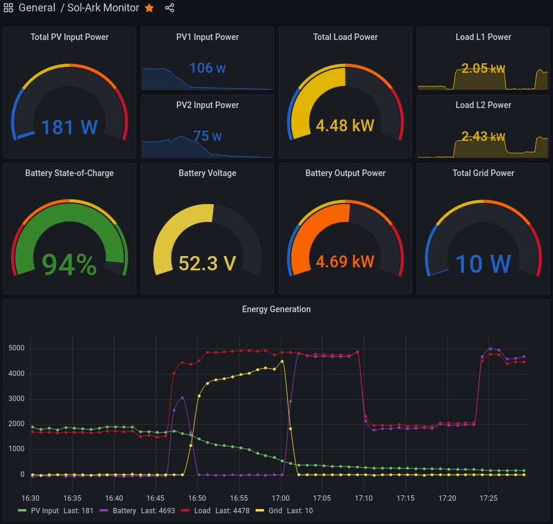
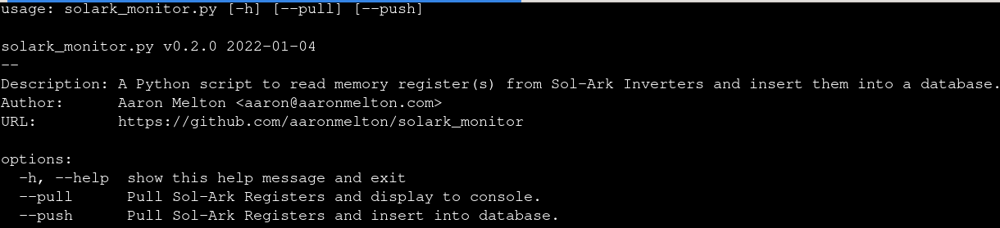

# Sol-Ark Monitor

A Python script to read memory register(s) from Sol-Ark Inverters and insert them into a database.

## Getting Started

### About This Code
This script was written in order to maintain local control of your Sol-Ark Inverter.

It is known to work with Model Sol-Ark 12k-P, COMM 142a-0717, MCU Ver6983

#### Why Re-Invent The Wheel?
* Your Sol-Ark Inverter likely came with a WiFi dongle that allows for remote
  monitoring, troubleshooting and software updates of your inverter.  I have a
  few issues with Sol-Ark's implementation of these remote capabilities:
  - The WiFi dongle allows for unprotected access via http.  Any individual on
    the same WiFi network can alter the firmware of the dongle, change it's WiFi
    AP association, use it to scan for nearby access points and who knows what
    else.  I prefer to unplug it unless in need of support but I'd also like to
    monitor my inverter's activity without standing in front of it, too.
  - The same data I'm collecting via MODBUS protocol from the inverter is being
    sent overseas to China.  I perfer my data not be collected by unknown parties
    in a different country.
  - If the data is being shipped off-site to China, I'll assume remote access is
    also provided by the same connection and that's all the more reason to retain
    local control of my investment.  (I'll happily retract this statement if
    Sol-Ark cares to correct me.)
  - The application/website (PowerView) used by Sol-Ark is also developed and
    maintained in China.  This application allows you to remotely alter the
    configuration of your inverter.  This same application also allows anyone
    to view the Operational Data of other Customers simply by providing their
    serial number, so I don't trust the possibility that a determined individual
    with the correct scripting skillz may not be able to alter the configuration
    of my inveter without my knowledge OR consent.
* Other vendors already have well-established products in this space.
  [Victron Energy's Venu OS](https://github.com/victronenergy/venus) and [Solar Assistant](https://solar-assistant.io/) come to mind.
  But I want a database with my own data to play with.  I'd also like to build
  my own dashboards and integrate it into my own home automation/monitoring
  solution.
* Because I can.  I enjoy writing code and learning new technology.

#### Design Decisions
* I'm only working with Read-Only memory registers here.  My inverter is still
  too shiny for me to venture into voiding-warranty territory.
* solar_modbus.py was created to contain what I knew about the Sol-Ark's memory
  registers; I later included the range values as a sanity check.  (What I
  previously thought were incorrect values by my inverter were actually being
  decoded incorrectly.)
* MySQL: I went with what I know.  I would have liked to try a time-series
  database (like InfluxDB).  Perhaps in a new release?
* Script variables are picked up from the environment (see config.py).

### Prerequisites
* A computer located near your inverter to make the Modbus calls to the
  inverter.  (I'm using a Raspberry Pi 3 Model B v1.2.)
* A specially-crafted cable to connect your computer to your inverter.  The
  MODBUS/RJ45 Application Note in your manual has some info.  I'm using a
  [JBtek USB to RS485 Converter Adapter](https://www.amazon.com/gp/product/B00NKAJGZM/ref=ppx_yo_dt_b_asin_title_o06_s00?ie=UTF8&psc=1) 
  as mentioned by [Solardad's first post in this thread](https://diysolarforum.com/threads/sol-ark-inverter-monitoring.23717/#post-279953) on the Solar DIY Forums.

#### Python Libraries
* See [pyproject.toml](pyproject.toml)

### Instructions For Use

## Acknowledgements
* Solardad's [Sol-Ark - Inverter Monitoring](https://diysolarforum.com/threads/sol-ark-inverter-monitoring.23717/) thread on DIY Solar Power Forum.
* offthehook for [sharing his code](https://diysolarforum.com/threads/sol-ark-inverter-monitoring.23717/post-299534) illustrating how to read memory registers via pymodbus.
* Borrowed some techniques from [Home Assistant integration for the SolArk PV Inverter](https://github.com/pbix/HA-solark-PV).

## Authors
* **Aaron Melton** - *Author* - Aaron Melton <aaron@aaronmelton.com>
